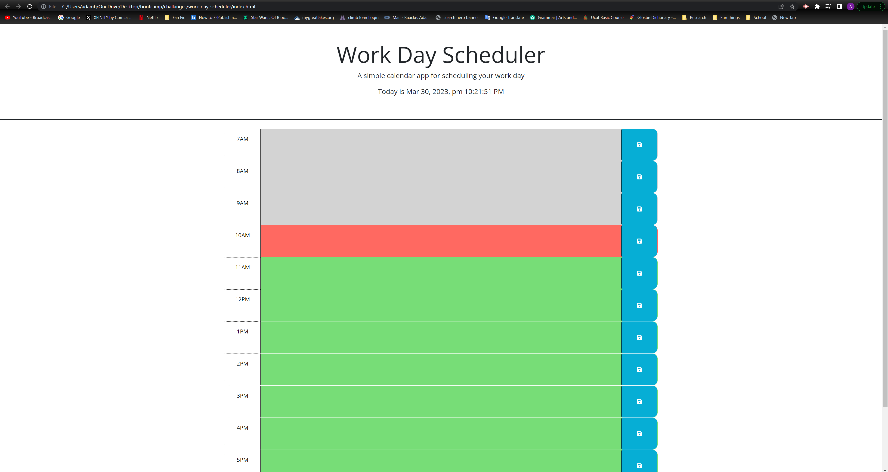

# work-day-scheduler

## Description

- An employee requested that we develop a daily planner to help them organize thier work day.
- After be provided with the base JS, HTML, and CSS code to have application run I was left with providing aditional code to allow it update live through out the day.
- I waas sucessful in applying a live date and time to the header but fell short on the other requirements.
- while I believe I have the currect process i plan to reach out to peers in the neer future for get the code to made contact with my intent.

## Table of Contents 

- [Installation](#installation)
- [Usage](#usage)
- [Credits](#credits)
- [License](#license)

## Installation

[day scheduler]()

## Usage

the page uses links at the top pf the page for easy navigation.

## Credits

N/A

## License

N/A